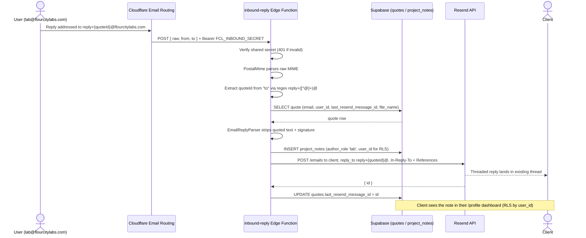

# Flour City Labs

Flour City Labs is a working full-stack project: a marketing site, an automated email deliverability analyzer, and a client project system with email reply threading. It runs in production and demonstrates serverless architecture, edge email parsing, and secure auth flows.

**Live site:** https://flourcitylabs.com<br>
**Email analyzer:** email any message to analyze@flourcitylabs.com

Web and email consulting for Rochester, NY small businesses. This monorepo contains the marketing site, an automated email deliverability analyzer, a client project management system, and a 3D printing quoting app (secondary service).

---

## Apps

| App | Stack | Purpose |
|-----|-------|---------|
| `apps/labs` | Vite + React + Tailwind CSS v4 + Supabase + Resend | Marketing site, Email Analyzer, contact forms, client project dashboard |
| `apps/email-worker` | Cloudflare Email Worker + Resend | Inbound email → deliverability analysis → plain-English reply |
| `apps/email-parser` | Node.js CLI | Standalone email header parser (development/testing tool) |
| `apps/slicer` | Next.js 16 + Prisma + Neon + Stripe + Resend | 3D printing order platform (partially built, not live — future work for flourcityprints.com) |
| `shared/email-core` | Pure ESM (zero dependencies) | Shared email header parser + deliverability analyzer, imported by labs, the worker, and the CLI |

The repo is an **npm workspace**: run `npm install` once at the root, then per-app commands (`dev` / `build` / `test`) from each app directory. `apps/slicer` is intentionally excluded from the workspace (not live, native deps).

---

## Architecture at a glance

The system spans three deployment targets and three runtime environments:

- **Cloudflare Email Worker** (`apps/email-worker`) — stateless ES module that runs on email ingest. No persistent process, no queue. One email in, one DNS + header analysis, one reply out via Resend. Live at `analyze@flourcitylabs.com`.
- **Supabase Edge Functions** (`apps/labs/supabase/functions/`) — two Deno functions. `send-notification` handles form submissions with Turnstile bot verification and Resend notifications. `inbound-reply` handles email reply threading: PostalMime parses the raw message, EmailReplyParser strips quoted content, the reply goes to Supabase as a project note and forwards to the client via Resend with `In-Reply-To` and `References` headers.
- **Vite + React SPA** (`apps/labs`) — deployed on Vercel, auto-deploys from main. Hosts the marketing site, in-browser email analyzer, contact and checkup forms, and an authenticated client project dashboard at `/profile`.
- **Next.js 16 app** (`apps/slicer`) — partially built 3D printing order platform. Not deployed; future work for `flourcityprints.com`.
- **Shared core** (`shared/email-core`) — the email header parser and deliverability analyzer live in one pure, dependency-free ESM package. The browser analyzer, the email worker, and the CLI all import the same implementation, so there's one set of logic and one test suite behind three runtimes.

The interesting engineering decisions are documented in the code and inline notes: the email worker README covers the three-tier severity design, dual-audience report structure, and why the intake inbox is intentionally permissive.

---

## Email Header Analyzer

The main portfolio piece. There are three ways to use it:

1. **Email** (primary): send any message to `analyze@flourcitylabs.com`. The Cloudflare Email Worker intercepts it, runs the full analysis including live DNS lookups, and replies within seconds with a plain-English report.
2. **File upload**: upload a `.eml` or `.msg` file on the website. Analysis runs in the browser — no raw content leaves the machine.
3. **Paste**: paste raw headers directly into the text area on the site.

The browser paths (file + paste) check headers only. The email path also does live DNS lookups for SPF records, DKIM public keys, DMARC policy, and MX records.

**Report design:** The report is structured for two audiences at once — a non-technical reader who wants to know "is my email okay," and a technical reader who wants to verify the analysis. The top of the report has a jargon-free plain-language verdict. The full raw data (DNS records, Authentication-Results headers, Received chain with hop timing) is preserved underneath as proof. A three-tier severity system (Pass / Warn / Fail) distinguishes low-stakes advisories like `DMARC p=none` from genuine failures like a missing SPF record.

**Blacklist and reputation checks** are planned — likely linking out to or embedding MXToolbox lookups.

See [`apps/email-worker/README.md`](apps/email-worker/README.md) for deployment details.

---

## Testing

The valuable logic — the email header parser and deliverability analyzer in `shared/email-core` — is covered by a **characterization test suite**: a corpus of `.eml` fixtures that each isolate one behavior (SPF/DKIM/DMARC pass and fail, the DMARC `p=none` advisory, From/Return-Path mismatch vs. legitimate subdomain, folded headers, unusually slow hops, a missing Received chain). The same corpus runs against both the shared package and the CLI, proving every consumer agrees on behavior.

```bash
npm install            # once, at the repo root (npm workspace)
npm test --workspaces  # runs every package's test suite
```

UI views and I/O surfaces (Resend, DNS, Supabase) are integration boundaries — smoke-tested, not unit-tested. New pure logic is written test-first (TDD); existing behavior is pinned with characterization tests before any refactor.

---

## Contact and Checkup Forms

Both the contact form and the free email checkup form on the labs site share the same submission flow:

1. Client submits the form in the browser
2. Cloudflare Turnstile token is verified server-side (bot protection; honeypot field provides a second layer)
3. A row is inserted into the Supabase `contacts` table
4. The client calls the `send-notification` Supabase Edge Function with the new record
5. The Edge Function verifies the Turnstile token with Cloudflare's API, then sends an email notification to `lab@flourcitylabs.com` via Resend

The contact form is at `apps/labs/src/views/ContactView.jsx`. The free email checkup form lives in `apps/labs/src/views/EmailView.jsx` (which also hosts the in-browser analyzer). Both insert into the same `contacts` table; the message body distinguishes checkup requests from general inquiries.

---

## Client Project System (labs)

The labs site has a lightweight project management system built on Supabase, separate from the slicer's Prisma/Neon database.

**Inbound:** When a client submits a quote request through the labs site, `send-notification` sends two emails via Resend: an auto-reply to the client (which establishes the email thread) and a lead alert to the admin. The auto-reply's reply-to is `lab@flourcitylabs.com`. The `reply+{quoteId}@flourcitylabs.com` threading address is introduced later, on the first lab reply forwarded by `inbound-reply`.



**Outbound (reply threading):** When the admin replies from `lab@flourcitylabs.com`, Cloudflare Email Routing forwards the inbound reply to the `inbound-reply` Supabase Edge Function, authenticated with a shared secret. The function:
- Parses the raw email using PostalMime
- Extracts the quote ID from the `reply+{quoteId}@` address
- Strips quoted/signature content using EmailReplyParser
- Inserts the cleaned reply into `project_notes` as `author_role: 'lab'`
- Forwards the reply to the client via Resend with threading headers so it lands in the same email thread

**Client dashboard:** Authenticated clients can see their projects and the full note history at `/profile`. Project notes from both sides appear there in sequence.

---

## Slicer Admin Dashboard

`apps/slicer` is not deployed as part of the live `flourcitylabs.com` site. It's a partially built order platform intended for a future `flourcityprints.com` deployment, kept in the monorepo for continuity.

It includes a password-protected admin dashboard at `/dashboard` with four tabs:

- **Quotes** — all 3D print orders in table or Kanban board view, with status tracking (PENDING → PAID → PRINTING → SHIPPED)
- **Materials** — manage available filament materials and their settings
- **Messages** — contact form submissions, with unread count
- **Settings** — configure pricing, quote options, and feature flags

The dashboard header shows live metrics: total revenue from paid/completed orders, active orders on the printer, and filament used across all materials.

Auth is a custom env-var password check (`ADMIN_PASSWORD`). There is no per-route middleware — each admin API route validates the session cookie manually.

---

## Running locally

```bash
# One-time install at the repo root — npm workspace links labs, worker,
# email-parser, and shared/email-core together.
npm install

# Marketing site + browser Header Analyzer
npm run dev -w apps/labs                                          # http://localhost:5173

# Email parser CLI (runs against the shared fixture corpus)
node apps/email-parser/src/index.js shared/email-core/fixtures/synthetic.eml
node apps/email-parser/src/index.js --json path/to/file.eml

# Email worker (local)
npm run dev -w apps/email-worker

# 3D printing app (NOT in the workspace — install separately)
cd apps/slicer && npm install && npm run dev                      # http://localhost:3000
```

---

## Services

| Service | Used by | Purpose |
|---|---|---|
| Supabase | `apps/labs` | Auth, database, Edge Functions |
| Neon (PostgreSQL) | `apps/slicer` | Prisma-managed database (slicer only, not live) |
| Resend | `apps/email-worker`, `apps/labs` (Edge Functions) | Transactional email |
| Cloudflare Email Routing | `apps/email-worker`, reply threading | Inbound email handling |
| Cloudflare Turnstile | `apps/labs` | Bot protection on public forms |
| Stripe | `apps/slicer` | Payment processing (slicer only, not live) |

---

## Supabase (apps/labs)

Schema migrations are in `apps/labs/supabase/migrations/`. Run them manually in the Supabase SQL editor.

**Tables:**

| Table | Written by | Purpose |
|---|---|---|
| `contacts` | Browser (anon) | Contact and checkup form submissions |
| `quotes` | Browser (authenticated) | Client project/service quote records |
| `project_notes` | `inbound-reply` Edge Function | Per-project notes and email replies, visible to client |
| `materials` | Admin | Available filament materials for the 3D printing quoting tool |
| `email_audits` | Browser (anon) | Per-analysis metadata from the browser Header Analyzer |
| `analyzer_leads` | Cloudflare Email Worker | Per-email metadata from the automated analyzer |

**Edge Functions:**

- `send-notification` — called by the browser after a Supabase insert. Verifies Turnstile or session auth, then sends email via Resend. Handles `contacts`, `quotes`, and `project_notes` table events.
- `inbound-reply` — called by Cloudflare Email Routing when a reply arrives at a `reply+{quoteId}@flourcitylabs.com` address. Authenticated by shared secret. Parses the reply, inserts a project note, and forwards the reply to the client via Resend with threading headers.
